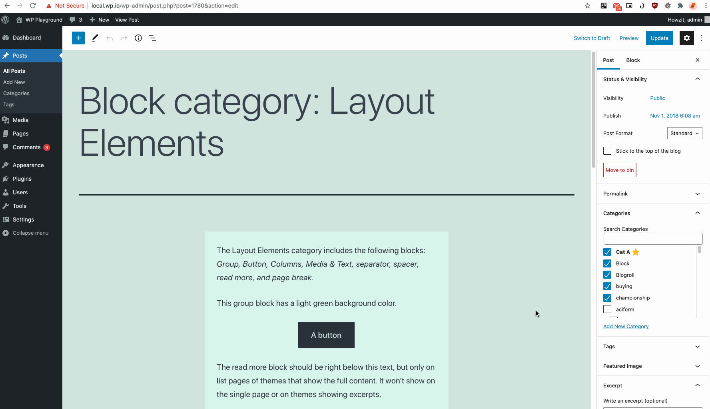
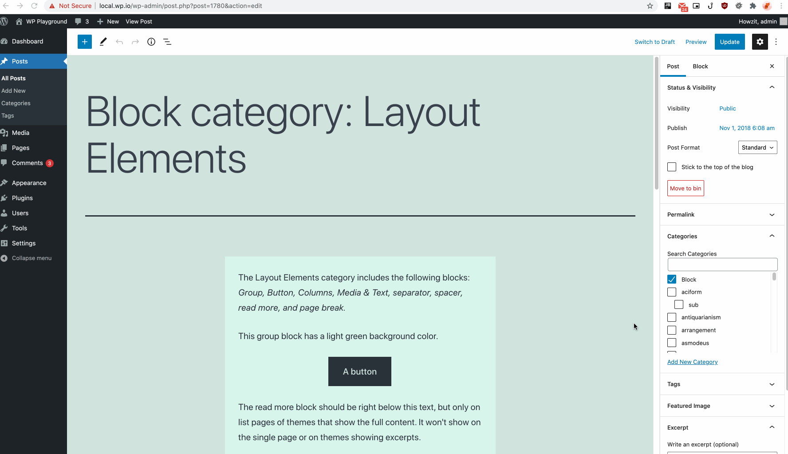
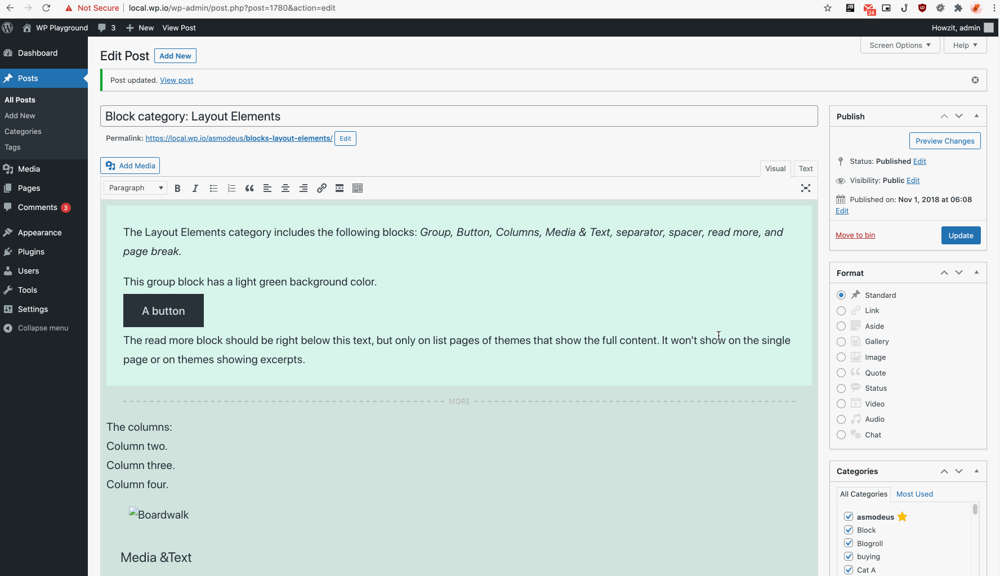
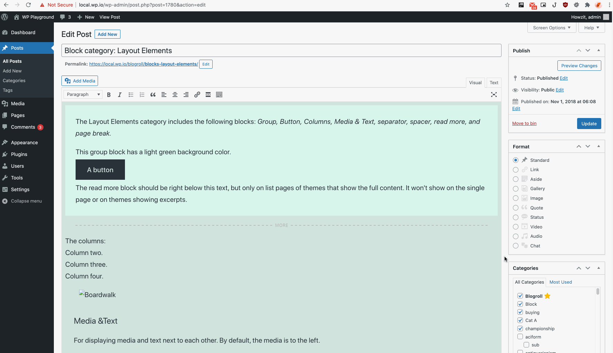
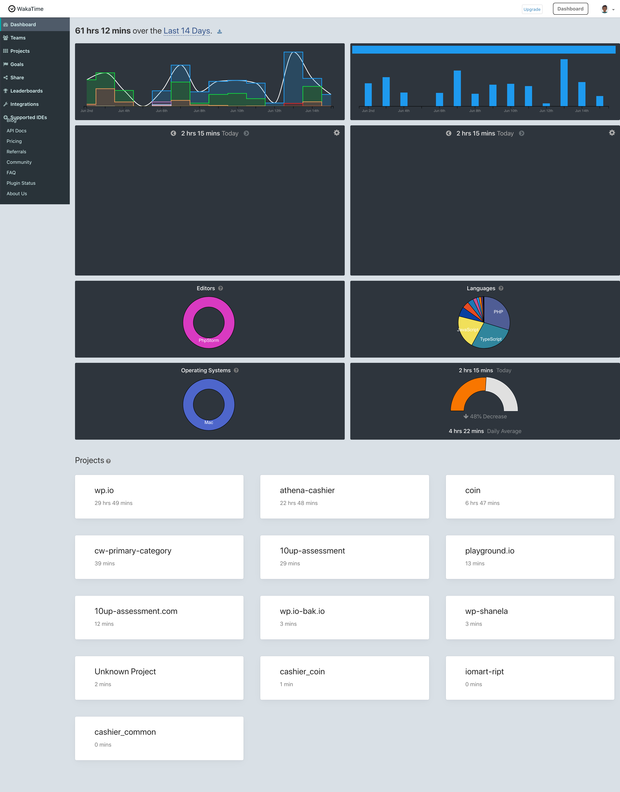

# CW | Primary Category (CWPC) #
**Contributors:** (this should be a list of wordpress.org userid's)  
**Tags:** category, primary  
**Requires at least:** 4.5  
**Tested up to:** 5.7.2  
**Requires PHP:** 5.6  
**Stable tag:** 0.1.0  
**License:** GPLv2 or later  
**License URI:** https://www.gnu.org/licenses/gpl-2.0.html  

This plugin allows you to set a Category as the 'Primary' Category

## Description ##
This plugin hooks works for both the Block AND the Classic Editors.

It will modify the current category selection box by adding in a ⭐ next to the category name which you can click to set that category as a primary category.

### Front Facing Features
The following front-facing changes will be made as a result of selecting a primary category:

1. Category Lists for a post will place the primary category first in the list, i.e. prioritizing it
	* typically these lists are generated with the `get_the_category_list` method
	* adds a new key `isPrimary` to the term object for potential styling

2. Should you use the following tag in your permalink structure `%category%`, it will always use the primary category

| Feature                           | Demo 															|
|-----------------------------------|---------------------------------------------------------------|
| Prioritizing the Category List 	|  			|
| Primary Category in Permalinks	| 	|

### Admin Features
1. Allows editors to select a primary category from the existing category box on the post edit and post creation page
	* will of course allow editors to remove this value by clicking the 'Remove Primary' CTA
	* this should also go without mentioning, but selecting a new primary category will override the existing primary category

2. Sorts the Category Post Meta Box by "Primary Category" first and then the rest of the bad boys
3. All methods in this plugin are overridable via themes
4. All actions and filters used in this plugin use a default priority of 22
5. Code fragments are separated into admin and public facing code
	* Admin Code only runs on the edit or new post screens
6. Only users that can actually edit posts have the option of successfully making changes to the primary category
7. Sanitization of Primary Category metadata prior to saving

| Feature                                       | Block 																		| Classic 																			|
|-----------------------------------------------|-------------------------------------------------------------------------------|-----------------------------------------------------------------------------------|
| Selecting \ Deselecting a Category as Primary |  			|  			|
| Prioritizing the Category Box                 |  	| 	|

-----

## Screenshots ##

### 1. This screen shot description corresponds to screenshot-1.(png|jpg|jpeg|gif). Note that the screenshot is taken from ###
/assets/screenshot-1.png)

the /assets directory or the directory that contains the stable readme.txt (tags or trunk). Screenshots in the /assets
directory take precedence. For example, `/assets/screenshot-1.png` would win over `/tags/4.3/screenshot-1.png`
(or jpg, jpeg, gif).
### 2. This is the second screen shot ###
/assets/screenshot-2.png)

----

# 10up Brief

## Primary Category Project
### Background
Many publishers use categories as a means to logically organize their content.

However, many pieces of content have more than one category.

Sometimes it’s useful to designate a primary category for posts (and custom post types).

On the front-end, we need the ability to query for posts (and custom post types) based on their primary categories.

### Your Mission
Create a WordPress plugin that allows publishers to designate a primary category for posts.

We’ve intentionally left implementation details out so you have a chance to show us strategic thinking.

The code you write should be secure and performant.

When you’re done, send us the code as an archive or a link to a repository.

### Time Tracking

I've used a time tracking tool called wakatime that calculates the total "coding" time on a project.

Here is a link to it: https://wakatime.com/@craigiswayne

In total, I spent approximately 30 hours on this assessment.

*Please track your time so we have an accurate understanding of how long it took you to complete the project.*

---

### Investigation
The spec is quite clear and simple, So I thought to myself, what would be the purpose of this to **USERS** of the site?

1. Should breadcrumbs show the primary category in there somehow?
2. When a post is displayed with categories below it, should the primary category be first AND have a different markup for look-and-feel?
3. In the spec it mentioned that we need the ability to query primary category for posts... this requires more thought, how would a user of the site query specifically primary categories?
4. Should i update the existing category selection metabox so that a user can can select, mark as primary?
	* or should i create an entirely different metabox?
5. Breadcrumbs should pay attention to nested category selection as primary category
6. Permalinks should update as well after selecting a primary category
7. Also care about filters used in the plugin so that developers can override them
8. Also care about overriding from a theme's perspective

-----

### Journey
#### Metabox method
So my initial thought was to create a metabox that would look at already selected categories, and the user can then choose from those one's

But then realized if the are creating a new category or if they want to assign a new cat and then make it primary,
it would require a save and then only will the dropdown populate with the new category

Then I thought why not add some logic to the existing category metabox

So that seemed to work pretty well...
And whilst testing I realized, that the existing category metabox had some filters i could hook into that would eliminate alot of the JS

Obviously this is only for the Classic editor.

I needed a gutenburg metabox...

This is what took up most of my time...

The major issue i faced was hooking into the existing category term selector and overriding that.

The next issue i ran into was "dispatching" changes to the backend via post meta

---

### Assumptions
* Support for php <7 & >=5.4 for older wordpress sites
	* no return types on php methods
	* no typed parameters on methods
	* no null coalescing operators

* The only role restriction is applied for users that can edit posts
	* all js and css is loaded nonetheless to ensure frontend logic is applied

----

#### Known Issues
* Replicate the functionality from the Category Box on Edit and New Post screen, on the Quick Edit Panel on Post WP_List_Tables
* The "Remove Primary" text sometimes sits over the category name for long category names
* Since I always set the checkbox for the category as selected when assigning it as primary, unselecting the category still leaves it as primary
